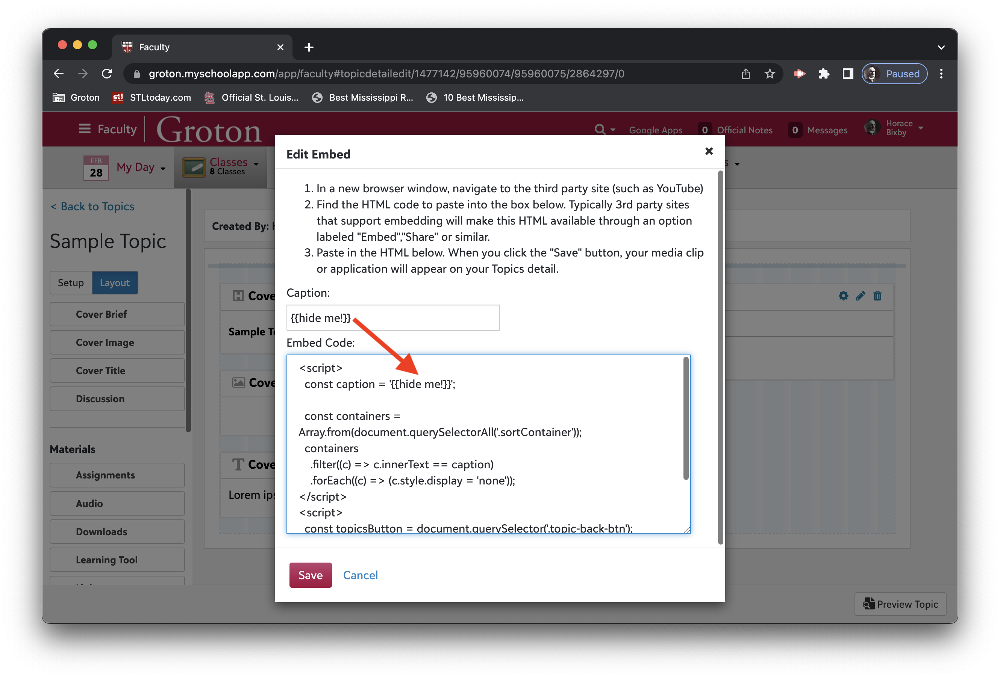

# Blackbaud Embeds

A collection of handy snippets to embed in the Blackbaud LMS for "enhanced" functionality.

### How to use

All of the snippets are organized in the [embeds](./embeds#embed-snippets) folder, saved in HTML files.

1. Copy the contents of the HTML file and…
2. Paste it into an embed widget in Blackbaud, then…
3. Then, look for `TODO` notes on what to change to customize it to your purpose.

Because you can paste multiple snippets into the same embed widget, it is often useful to hide the embed widget from students. You can do this by using [embeds/\_shared/hide-embed.html](./embeds/_shared/hide-embed.html) to hide the widget based on its caption.

